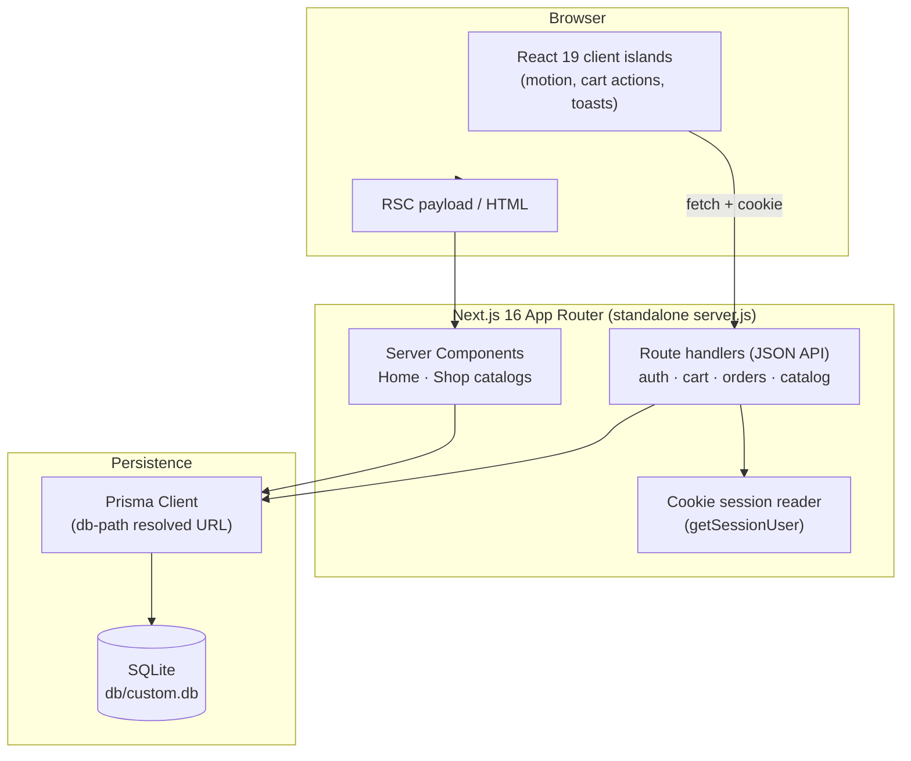
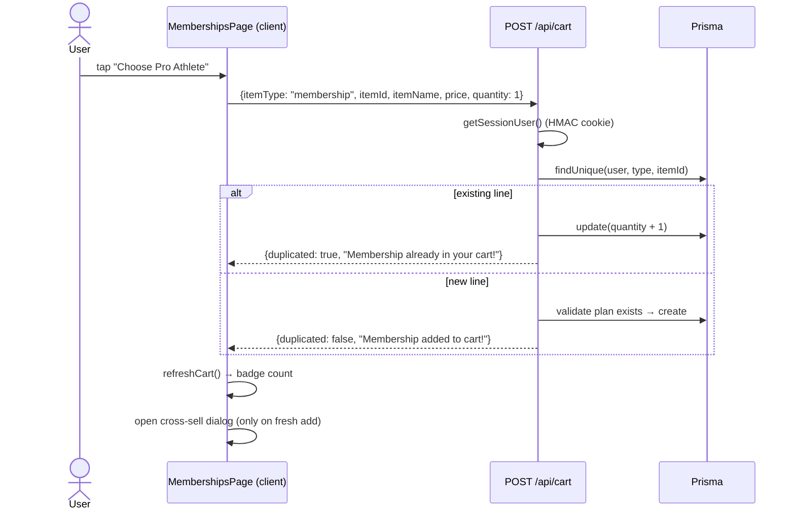
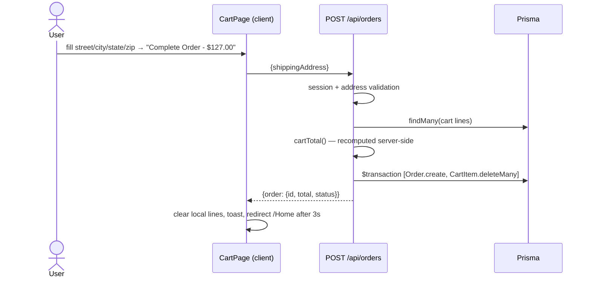

# FitPro GYM App — Master Project Architecture Document (PAD) v1.6.1

**Classification:** Internal Engineering Reference
**Status:** DEFINITIVE, PRODUCTION-LOCKED BLUEPRINT
**Companion Document:** `README.md` (product overview) · `CLAUDE.md` (conventions) · `AGENTS.md` (command sheet)
**Reference Application:** `https://fit-pro-gym-app-c6cbb3a3.base44.app/`
**Last Updated:** 2026-09-28
**Audience:** Senior Engineers, Tech Leads, DevOps, Onboarding Engineers, and AI Coding Agents
**Rule:** Every architectural decision in this document traces to a specific rationale. Nothing is here "because it's popular."

---

#### Revision Block — v1.6.1

- `[v1.6.1]` Session-9 parity re-audit (target re-audit; **zero code defects — docs-consistency fix only**). Full audit re-run against the live reference: mobile navigation verified end-to-end on BOTH sites at 390×844 (5th consecutive session, zero Tailwind v4 bugs); entity ground truth UNCHANGED from session 8 (product tie order [junk, Yoga Mat, Dumbbells, Pre-Workout, Whey] stable across 3 consecutive fetches; memberships two tie groups unchanged); the target's CSS bundle unchanged since session 8 (`index-BCeQAlMu.css`); all v1.5/v1.6 pinned geometries re-measured at parity (hero 840px desktop / 1111px mobile with h1 60px/45px lines and lede 32px/33px, Memberships hero 424px, Shop h1 48px + #737373 placeholder + untyped search, login card 746px with plain 20px labels, pointer cursors); full-page text diffs across all 5 routes clean modulo the documented junk-row exclusion and avatar initial; the cross-sell dedupe path (quantity bump + "already in your cart" toast, no dialog on duplicate adds) verified live on both sites. Remediation: the §15 ledger's "Home shop preview / cross-sell" row still carried the stale session-5 tie order [Pre-Workout, Yoga Mat, Dumbbells, Whey] — the session-8 update had corrected the "Cross-sell dialog" and "Shop" rows but missed this third one, leaving the definitive reference internally inconsistent. Fixed to the current audited order with the junk-row displacement note. Tests: 47 unit + 74 e2e green on arrival and unchanged (no code or spec deltas this cycle).
- `[v1.6]` Session-8 parity remediation (target re-audit; 1 root defect, TDD-executed) — **theme: the reference's `-created_date` product tie order is SERVER-DRIFTABLE.** The four real products tie at 2025-07-01T14:15:08.553Z and the reference backend's tie order flipped between sessions (session-5 audit: [Pre-Workout, Yoga Mat, Dumbbells, Whey] → 2026-09-28 audit: [Yoga Mat, Dumbbells, Pre-Workout, Whey], stable across 3 consecutive fetches). Compounding it, the reference's injected "XSS-INJECT-TEST" junk row (featured, created 2026-05-15 — newer than every real product) now holds slot 1 of its `featured&-created_date&limit=4` home preview window and displaces Whey from the window entirely. Remediation: the seed's 200ms `createdAt` stagger reordered to pin the CURRENT audited tie order — the clone's home "Professional Fitness Gear" preview renders [Yoga Mat, Dumbbells, Pre-Workout, Whey] and the cross-sell dialog (limit 3) renders [Yoga Mat, Dumbbells, Pre-Workout], both matching the reference's real-product order modulo the standing junk-row exclusion (the clone shows all four real products, with Whey filling the slot the junk row occupies on the reference). The Shop page is unaffected on both sites (client-side alphabetical default sort). The home + cross-sell e2e order pins were updated RED-first (both failed for exactly the audited reason pre-fix). Also: the vitest.config.ts header comment was corrected from the scaffold's leftover seam list to the repo's actual seams. Target-side status: mobile nav re-verified end-to-end at 390×844 (4th consecutive session, zero Tailwind v4 bugs); all v1.5 pinned geometries re-measured at parity (hero 840px desktop / 1111px mobile, Memberships hero 424px, login card 746px, placeholders #737373, button cursors); the target's CSS bundle was redeployed since session 7 (now `index-BCeQAlMu.css`) but its v3-emission semantics are unchanged; cart writes still broken target-side; memberships entity data unchanged. Tests: 47 unit + 74 e2e (unchanged counts, 2 order pins re-pinned).
- `[v1.5]` Session-7 parity remediation (target re-audit; 13 root defects, TDD-executed) — **theme: the reference is Tailwind v3-compiled, the clone is v4, and the version gap surfaces as cascade/semantics differences.** Discovered by stylesheet forensics (the reference's live CSS emits literal rem values, `--tw-shadow` reset vars, responsive variants at the END, and no `--tw-leading` mechanism). Remediations: the Home hero h1/lede gained `md:leading-none` / `md:leading-[2rem]` (v3's responsive text-size rules beat base `leading-*` utilities — v4's `--tw-leading` reverses that; the hero had rendered 66px taller per text block); the speed-line streaks restored to `absolute` (the `SpeedLines` component had omitted the positioning class since session 2 — the 8 lines stacked in-flow, inflating BOTH hero sections by 48px while still animating, which is why text-level audits never caught it; Home hero now 840px = reference, Memberships hero 424px = reference); `@theme inline`'s 31 shadcn color mappings wrapped in `hsl()` (the scaffold's bare `var(--muted-foreground)` resolved to the invalid string "0 0% 45.1%", silently dropping every `text-muted-foreground` / `border-input` / `placeholder:text-muted-foreground` declaration to currentColor — the placeholder parity bug was this); a base-layer `button,[role=button]{cursor:pointer}` rule (the reference's bundle carries it); the Shop hero corrected to the reference's `text-4xl md:text-5xl … mb-6` / `text-xl text-gray-300 max-w-3xl mx-auto` / `mb-12` wrapper (the h1 had rendered 36px vs 48px); the shop search input de-typed (`type="search"` → untyped) and its placeholder → `placeholder:text-muted-foreground` (#737373 — the reference's Input base wins its v3 cascade over the page's `placeholder-gray-400`, which is inert legacy-class syntax there); the 4 checkout inputs' placeholders likewise; the login labels switched to the reference's PLAIN `<label>` markup (`text-sm font-medium`, 20px line-height — its login shell is a separate platform bundle whose labels lack `leading-none`) while the shadcn Label base was corrected to the reference's v3 form for the CHECKOUT labels (`text-sm font-medium leading-none peer-disabled:…`); the login input wrappers gained `mt-1.5` (v4's `space-y` emits margin-bottom on the PRECEDING sibling — ignored on the inline label, collapsing the 6px gap; the login card now 746px = reference); the home "View All Plans" CTA corrected from a gradient `size="lg"` pill to the reference's solid `bg-blue-600` default-size button (text-sm font-semibold, h-10, px-6, 191×40px, ArrowRight w-4 h-4). TEST HARDENING: the session-6 card-geometry e2e spec had a latent race (two sequential `boundingBox()` calls straddling the framer-motion entrance) — now measured atomically in one `evaluate()`. Target-side status: cart writes still broken (unchanged since session 6); entity data unchanged. Tests: 47 unit + **74 e2e** (64 → 74).
- `[v1.4]` Session-6 parity remediation (target re-audit; 7 root defects, TDD-executed): the seed catalog corrected to the reference's REAL entity data — exactly FOUR products (its entity API holds 4 real + the injected junk row; the clone's seed had carried 4 invented demo products since the initial build, rendering 8 Shop cards against the reference's 4 real ones); the Shop card body gained the reference's `p-4 flex-grow flex flex-col justify-between` (price rows now pin to the card bottom — 16px row gap — even next to 2-line names like "Professional Dumbbells Set"); the Shop + home-preview grids corrected to `gap-8` (24px → 32px; the preview grid also dropped a non-reference `pb-4`); the cross-sell dialog card corrected to `rounded-xl` (it had reused the Shop grid card's `rounded-2xl`) with `transition-transform` images (the reference swaps hover opacity instantly); the Shop empty state replaced with the reference's single centered paragraph ("No products found matching your criteria." — `text-center py-24` + `text-gray-400 text-lg`, no icon/heading); the memberships rail's `.scrollbar-hidden` utility removed (the reference keeps the browser's native scrollbar). OPS: a workspace re-clone had left node_modules/lucide-react at 0.525.0 against the 0.475.0 lockfile pin — the icons e2e specs caught it (0.5xx dumbbell/bag geometry); fixed via `bun install --frozen-lockfile` + rebuild. Target-side anomaly logged: the reference's cart writes currently fail silently (POST 200, nothing persisted) — clone cart parity relies on the previously extracted, e2e-pinned markup. Tests: 47 unit + 64 e2e.
- `[v1.3]` Session-5 parity remediation (target re-audit; 3 root defects, TDD-executed): the home plan preview now mirrors the reference's BUNDLE ALGORITHM — it renders `[newest, HARDCODED-Pro, second-newest]` over `Membership.list("-created_date", 3)` (the middle card is a hardcoded Pro Athlete with FIVE design features incl. "Premium equipment access", NOT the entity's six-feature row; the third fetched entity is discarded) — extracted verbatim from the reference's JS bundle into `src/lib/home-featured-plan.ts` (unit-pinned + e2e-pinned); seed creation dates now mirror the reference's REAL entity dates (fetched live: Basic Fit + Pro Athlete 2025-07-01, Starter + Family Pack 2025-07-30 — two tie groups broken by the reference's own rendered order, so `-created_date` desc = [Family Pack, Starter, Pro Athlete, Basic Fit]); product seed gained a 200ms `createdAt` stagger anchoring the reference's featured tie order [Pre-Workout, Yoga Mat, Dumbbells, Whey] (featured preview `limit=4` and cross-sell `limit=3` queries were already `createdAt desc` — the stagger makes them deterministic). Tests: 47 unit + 58 e2e.
- `[v1.2]` Session-3 parity remediation (9 root defects, TDD-executed): lucide-react repinned from ^0.525.0 to **0.475.0** — the reference bundle's exact version (0.5xx redesigned ShoppingBag/Dumbbell/Menu/LogOut/Mail/Search/Users; geometry now pinned by `tests/e2e/icons.spec.ts`); login card rebuilt to the reference's DOM (real 480×480 logo asset `public/login-logo.png`, Google button, OR divider, header structure, red Alert error "Invalid email or password" with matching API copy, absolute page title "FitPro GYM App"); `/login` no longer redirects authenticated visitors (reference renders the form); `/signup` now renders the reference's branded 404 (its SPA shell serves HTTP 200 with 404 content — the reference never built a signup page); app-wide 404 page (`src/app/not-found.tsx` + `src/lib/not-found-name.ts`, unit-pinned); Memberships Choose buttons gained the reference's ShoppingCart icon; Cart title → "Cart"; `--font-sans` pinned to the reference's `ui-sans-serif, system-ui…` stack (Tailwind ≥ 4.1 ships a v3-style default); home plan preview now runs the reference's query (three newest plans by `createdAt` desc — seed reordered + hourly `createdAt` stagger for determinism). Tests: 40 unit + 57 e2e (16 home parity + 5 icon-geometry/404 pins).
- `[v1.1]` Session-2 parity remediation: hero/memberships speed lines corrected to the reference's 8-line spec (extracted from the live DOM + bundle, pinned by `src/lib/speed-lines.test.ts`); hero gradient canvas + scrim/tint layers; Why-Choose rebuilt (glass cards, users/award/zap/star, scale-in values); Memberships rail badge → Crown at the reference's top-6+mt-10 offset; Shop toolbar → sticky card + 4-col grid + hardcoded Title Case categories (`src/lib/shop-categories.ts`); header logout buttons → `text-xs`; login card/Google button polish; broken Kettlebell seed image replaced; `NEXT_PUBLIC_SITE_URL` wired to `metadataBase`. Tests: 36 unit + 43 e2e (15 new home reference-parity specs).
- `[CA]` Initial PAD for the completed clone: full recon → implementation → test → documentation cycle.
- `[SYN]` Domain model mirrored 1:1 from the reference's base44 entity API (`Product`, `Membership`, `CartItem`, `Order`, `User`) — names and shapes preserved for behavioral parity.
- `[SAN]` Auth secrets, database files, and session states excluded from version control (git-ignored).

---

## Table of Contents

1. [Executive Summary](#1-executive-summary)
2. [Technology Stack (Version-Pinned)](#2-technology-stack-version-pinned)
3. [Architecture Decision Records (ADRs)](#3-architecture-decision-records-adrs)
4. [System Topology](#4-system-topology)
5. [Layer Model & Request Flows](#5-layer-model--request-flows)
6. [Directory Structure (Annotated)](#6-directory-structure-annotated)
7. [Critical Code Patterns & Invariants](#7-critical-code-patterns--invariants)
8. [Database Schema](#8-database-schema)
9. [API Contract](#9-api-contract)
10. [Security Architecture](#10-security-architecture)
11. [Testing Strategy](#11-testing-strategy)
12. [Build, Deployment & Operations](#12-build-deployment--operations)
13. [Developer Handbook](#13-developer-handbook)
14. [Known Issues & Design Debt](#14-known-issues--design-debt)
15. [Reference Parity Ledger](#15-reference-parity-ledger)

---

## 1. Executive Summary

FitPro GYM App is a self-hosted, production-ready clone of a base44-built gym membership and e-commerce application. The product surface is four pages — a marketing landing page (`/Home`), a membership plan catalog (`/Memberships`), a fitness store (`/Shop`), and a cart/checkout flow (`/Cart`) — plus authentication at `/login` (a branded 404 surface at `/signup`, mirroring the reference's unbuilt route). Under the hood it is a single Next.js 16 App Router application: server components render the catalog from Prisma/SQLite, typed JSON API routes own every mutation, and a custom scrypt/HMAC-cookie auth layer gates the cart and checkout. The design language (dark premium canvas, neon speed lines, glass cards, per-tier plan gradients, and the exact toast copy) is measured parity with the reference, extracted from its live DOM, computed styles, network traces, and JS bundle.

**Why it exists:** the reference is a closed SaaS artifact (base44-hosted, entity API behind their auth). The clone reproduces the complete user-facing behavior on infrastructure you own, with a test suite that pins it.

**Non-goals (deliberate):** Google OAuth (no credentials in a self-hosted clone — button renders for parity, degrades to an explanatory toast), email sending on order placement (toast only, like the reference's UX), payment processing (orders persist as `pending`, matching the reference's Order entity state machine start), and an admin back-office (catalog is seeded, not managed at runtime).

---

## 2. Technology Stack (Version-Pinned)

| Layer | Technology | Version (pinned by lockfile) | Rationale |
|-------|-----------|------------------------------|-----------|
| Framework | Next.js | ^16.3.6 | App Router + RSC for SEO-able catalog pages; API routes for the JSON contract; `output: "standalone"` matches the scaffold's ops story |
| UI runtime | React | ^19.3.0 | RSC-first; ref-as-prop; the repo's ESLint (React Compiler-era rules) enforces modern hook hygiene |
| Language | TypeScript | ^5.9.3 | Strict; `noImplicitAny: false` (scaffold decision) — public boundaries still fully typed |
| Styling | Tailwind CSS + `@tailwindcss/postcss` | ^4.3.3 | CSS-first v4: tokens in `globals.css`, automatic content detection, zero config files — validated in `docs/Tailwind-V4-Validation-Report.md` |
| Animation | Framer Motion | ^13.4.4 | The reference's animation engine (speed lines, card entrances, hover physics) |
| Primitives | Radix UI (dialog, select, label, popover, slot, …) | current | Accessible overlay/form primitives, shadcn-style composition |
| Iconography | lucide-react | 0.475.0 (pinned) | The reference bundle's exact build version — icon geometry e2e-pinned; upgrades drift 7 redesigned icons |
| Variants | class-variance-authority + clsx + tailwind-merge | current | shadcn component composition |
| Database | SQLite | bundled | Zero-config dev; file at `db/custom.db`; PostgreSQL swap documented |
| ORM | Prisma + `@prisma/client` | ^6.19.3 | Typed schema, `db push` workflow, `$transaction` for checkout atomicity |
| Auth | node:crypto (scrypt + HMAC-SHA256) | stdlib | Zero external auth dependency; no OAuth keys to manage |
| Unit tests | Vitest | ^5.0.1 | Fast pure-seam testing with `@` alias resolution |
| E2E tests | Playwright | ^1.63.0 | Drives the PRODUCTION standalone build on an isolated DB |
| Runtime | Bun | ^1.3 (dev machine) | Documented runtime for dev/build/start/seed; npm/npx fallbacks scripted |

---

## 3. Architecture Decision Records (ADRs)

### ADR-001 — Single Next.js application (not a Turborepo)

**Context:** The foundation repo (`scandihaven`) is a pnpm/Turborepo monorepo; the scaffold repo is a single app.
**Decision:** Single Next.js app with `src/app` + `src/components` + `src/lib`.
**Rationale:** The domain is one bounded context (catalog + cart + auth). A monorepo's package boundaries (commerce engine, auth package, UI kit) would add pipeline complexity with zero reuse here. The scaffold's `package.json`/`tsconfig`/`components.json` all assume a single app — deviating would break the pinned e2e/CI wiring.
**Consequences:** Extract packages only if a second app appears.

### ADR-002 — Capitalized routes (`/Home`, `/Memberships`, `/Shop`, `/Cart`)

**Context:** Next.js convention is lowercase paths; the reference app uses capitalized ones (its SPA router maps page names to `/Home` etc.).
**Decision:** Mirror the reference exactly; `/` and `/Home` render the same page; `/login`/`/signup` stay lowercase (also reference parity — the reference's `/signup` route renders its 404, which the clone mirrors with an HTTP-200 404 page).
**Rationale:** A clone's URL space is part of its contract (bookmarks, e2e assertions, header/footer links, the PWA `start_url`). App Router folders are case-preserving — zero cost.
**Consequences:** Any URL "normalization" breaks parity and the e2e suite — don't.

### ADR-003 — Prisma/SQLite with JSON-encoded structured fields

**Context:** The reference's base44 entities are schemaless-ish (features array, order items array, shipping object). SQLite has no scalar lists and no JSON column type in Prisma.
**Decision:** `MembershipPlan.features`, `Order.items`, `Order.shippingAddress` are JSON **strings**; (de)serialization is centralized in `src/lib/serialize.ts` with defensive parsing (`parseFeatures` filters non-strings; order parse failures degrade to empty).
**Rationale:** Keeps the zero-config SQLite story AND the reference's wire shapes (API returns real arrays/objects). Centralization prevents scattered `JSON.parse` failure modes.
**Consequences:** Never parse these fields anywhere else; DTOs carry the parsed forms.

### ADR-004 — App-level cart dedupe + storage-level unique constraint

**Context:** The reference checks for an existing `(user_email, item_type, item_id)` line before insert and bumps quantity with a distinct message ("Membership already in your cart!").
**Decision:** Reproduce the check-then-bump semantics in `POST /api/cart` (returning `duplicated: true` + the reference's message) AND add `@@unique([userEmail, itemType, itemId])` as defense in depth.
**Rationale:** Behavioral parity needs the message discrimination; the unique index makes the race window safe (a concurrent double-insert throws instead of duplicating).
**Consequences:** The e2e "dedupe" spec pins the toast copy.

### ADR-005 — Integer-cents money math

**Context:** Prices are floats in the reference (and in Prisma `Float`).
**Decision:** `cartTotal` computes in integer cents (`Math.round(price * 100) * quantity`, sum, divide once). `formatPrice`/display strings use `toFixed(2)`.
**Rationale:** `0.1 + 0.2 !== 0.3` — naive float reduce corrupts order totals. The unit suite pins 4 regressions (including a 100-line × $0.01 case).
**Consequences:** Storage keeps floats (parity); totals are always derived, never stored from client input.

### ADR-006 — scrypt + HMAC cookie sessions (no auth library)

**Context:** The scaffold's `.env` documents an `AUTH_SECRET` for "HMAC cookie auth"; the reference outsources auth to base44.
**Decision:** `src/lib/auth.ts`: scrypt password hashing (`salt:hash` hex), HMAC-SHA256-signed session tokens (`base64url(payload).sig`, 7-day expiry, `timingSafeEqual` verification), HttpOnly/SameSite=Lax cookie, in-process per-IP rate limiter (10 fails / 15 min → 429 + `Retry-After`).
**Rationale:** Zero external dependencies, no OAuth keys, and the exact properties the e2e suite needs (storageState replay via the login endpoint's cookie). `timingSafeEqual` everywhere prevents timing oracles.
**Consequences:** Rate limiter state is per-process (multi-instance deploys should move it to Redis — documented debt in §14).

### ADR-007 — State-driven mobile menu (the Tailwind v4 contract)

**Context:** Tailwind v4's `hidden` HTML attribute **overrides** display utilities; class-based toggles silently break when combined with the attribute. The repo's `skills/nextjs16-tailwind4/SKILL.md` §9/§10 pins the mobile-nav failure classes.
**Decision:** The mobile menu is **conditionally rendered** from React state (`menuOpen`), the trigger carries `aria-expanded`/`aria-controls`, desktop nav and mobile chrome use symmetric breakpoints (`hidden md:flex` vs `md:hidden`), and the route-change close uses React's render-time adjustment pattern (compare tracked pathname → setState during render) instead of an effect — satisfying `react-hooks/set-state-in-effect`.
**Rationale:** Both correctness (v4 precedence) and the modern lint bar; 8 e2e specs pin the behavior (aria state, auto-close, touch targets ≥ 44px, logged-out swap).
**Consequences:** Never toggle the menu via the `hidden` attribute; never "fix" the render-time adjustment back into an effect.

### ADR-008 — Server-rendered catalogs, client islands for interaction

**Context:** The reference is a CSR SPA that fetches entities on mount; this clone runs on Next.js RSC.
**Decision:** `/Home` and `/Shop` are server components reading Prisma directly (SEO, first paint); interactive sections (hero motion, add-to-cart buttons, filters) are client components receiving DTOs via props. `/Memberships`, `/Cart`, `/login` are client pages that fetch via the API on mount (they are per-user interactive surfaces).
**Rationale:** Marketing pages benefit from SSR; the reference's per-user fetch-on-mount pattern is preserved where it matters (cart/checkout correctness — the client refetches after every mutation; the server stays the single source of truth).
**Consequences:** `AppProvider` (`providers.tsx`) is the client state boundary: user, cart badge count, single-slot toast (3s auto-dismiss, reference parity).

### ADR-009 — Vendored `tw-animate-css`

**Context:** The package's `exports` map only exposes a `style` condition (`.` → `./dist/tw-animate.css`); Turbopack's CSS resolver cannot resolve the bare specifier `@import "tw-animate-css"`.
**Decision:** Vendor the dist CSS at `src/app/tw-animate-vendored.css` and `@import "./tw-animate-vendored.css"`.
**Rationale:** Unblocks the build deterministically; documented inline in `globals.css`.
**Consequences:** Upgrading `tw-animate-css` requires re-vendoring.

### ADR-010 — The db-path resolution contract

**Context:** SQLite `file:` URLs are resolved differently by the Prisma CLI (against `prisma/schema.prisma`) and by a running server (naively against CWD). The standalone server additionally `chdir`s into `.next/standalone`, which contains a traced schema copy — the naive rule would point the DB into the build output.
**Decision:** `src/lib/db-path.ts` implements: relative `file:` URLs resolve against the **first anchor containing `prisma/schema.prisma`**; `standaloneRepoRoot(dir)` recognizes the standalone dir (server.js + traced schema) and returns the real repo two levels up (null otherwise); absolute URLs and non-SQLite URLs pass through. `tests/db-path.test.ts` pins 15 behaviors.
**Rationale:** One database file, agreed upon by CLI, `next build`, dev server, and the standalone production server, regardless of CWD. The build script copies `prisma/schema.prisma` into `.next/standalone/prisma/` to feed the detector.
**Consequences:** Don't "simplify" this module without re-running its suite; don't remove the schema copy from the build script.

---

## 4. System Topology



**Processes:**

| Process | Command | Port | Database |
|---------|---------|------|----------|
| Dev | `bun run dev` | 3000 | `db/custom.db` (db-path resolved) |
| Production standalone | `bun .next/standalone/server.js` | `$PORT` (3000) | same, via standalone detector |
| E2E server | Playwright `webServer` | 3100 | `db/e2e.db` (isolated, seeded by global-setup) |

---

## 5. Layer Model & Request Flows

### Layers

1. **Route layer** — `src/app/**/page.tsx` + `layout.tsx`. Route groups: `(app)` carries the Header/Footer chrome; auth pages render bare.
2. **Component layer** — `src/components/**`: `ui/` (primitives), `layout/` (header/footer/toaster), feature folders (`home/`, `memberships/`, `shop/`, `cart/`, `auth/`).
3. **State layer** — `AppProvider` (client): session user, cart badge count, toast slot. NO cart line state lives here — the cart page fetches and mutates through the API and re-reads.
4. **API layer** — `src/app/api/**/route.ts`: zod-free explicit parsing (small surface), session-gated mutations, owner checks.
5. **Domain/lib layer** — `src/lib/`: `db-path`, `db`, `auth`, `serialize`, `utils` (money), each with unit tests on the pure seams.
6. **Persistence layer** — Prisma schema (5 models), seed.

### Flow: add a membership plan to cart



### Flow: checkout



---

## 6. Directory Structure (Annotated)

```
fit-pro-gym/
├── prisma/
│   ├── schema.prisma          # 5 models; SQLite; JSON fields documented inline
│   └── seed.ts                # idempotent: demo user, 4 plans, 4 products (reference's real catalog)
├── src/
│   ├── app/
│   │   ├── (app)/             # chrome layout: Header + Footer
│   │   │   ├── Home/          # landing page (≡ "/")
│   │   │   ├── Memberships/   # plan rail + cross-sell dialog
│   │   │   ├── Shop/          # server-rendered catalog + client grid
│   │   │   └── Cart/          # items, summary, checkout
│   │   ├── login/            # reference login card (no chrome, no auth redirect)
│   │   ├── signup/           # renders the reference's branded 404 (reference parity)
│   │   ├── not-found.tsx     # app-wide 404 (HTTP 404 for unknown routes)
│   │   ├── api/
│   │   │   ├── health/        # liveness probe
│   │   │   ├── auth/          # login · logout · me · register
│   │   │   ├── products/ · memberships/
│   │   │   ├── cart/ · cart/count/ · cart/[id]/
│   │   │   └── orders/        # checkout transaction
│   │   ├── globals.css        # Tailwind v4 @theme + brand tokens + vendored animate
│   │   ├── tw-animate-vendored.css
│   │   └── layout.tsx         # AppProvider + Toaster + metadata
│   ├── components/
│   │   ├── providers.tsx      # user/cart/toast client state
│   │   ├── ui/                # button · card · badge · input · label · select · dialog · skeleton · alert
│   │   ├── layout/            # header (mobile nav!) · footer · toaster
│   │   ├── home/              # hero · why-choose · plans-preview · shop-preview · cta-section · home-page
│   │   ├── memberships/       # membership-card · memberships-page (+ cross-sell)
│   │   ├── shop/              # shop-page (+ product card)
│   │   ├── cart/              # cart-page (rows · summary · checkout form)
│   │   ├── auth/              # auth-form (reference login card)
│   │   └── not-found-page.tsx # the reference's branded 404 surface
│   ├── lib/
│   │   ├── db-path.ts         # ADR-010 contract (15 unit specs)
│   │   ├── db.ts              # Prisma singleton
│   │   ├── auth.ts            # scrypt · HMAC sessions · rate limiter
│   │   ├── serialize.ts       # the ONLY JSON-field parser; row → DTO
│   │   ├── not-found-name.ts  # pathname → quoted 404 page name (4 unit specs)
│   │   ├── home-featured-plan.ts  # the reference's hardcoded home middle card + slot algorithm (7 unit specs)
│   │   └── utils.ts           # cn · cartTotal (cents) · formatPrice · toOrderLine
│   └── hooks/                 # (reserved)
├── tests/
│   ├── e2e/                   # global-setup · auth.setup · helpers · 8 spec files (74 specs)
│   └── db-path.test.ts        # resolution contract
├── docs/
│   ├── screenshots/           # current UI captures (desktop + mobile)
│   ├── DEPLOYMENT.md          # production guide
│   ├── Tailwind-V4-Validation-Report.md
│   ├── how-to-git-push-using-ssh-wrapper_SKILL.md
│   └── ssh_git_wrapper_v3.py  # push helper
├── skills/                    # repo-local agent skills (scaffold, unchanged)
├── next.config.ts             # standalone output + allowedDevOrigins
├── postcss.config.mjs         # @tailwindcss/postcss
├── playwright.config.ts       # :3100, storageState, isolated e2e.db
└── vitest.config.ts           # *.test.ts only, @ alias
```

---

## 7. Critical Code Patterns & Invariants

| # | Pattern / Invariant | Where | Why it must hold |
|---|---------------------|-------|------------------|
| 1 | **Money is integer cents until the final divide** | `src/lib/utils.ts` → `cartTotal` | Float `reduce` corrupts totals (0.1+0.2); pinned by unit tests |
| 2 | **`features`/`items`/`shippingAddress` JSON is parsed ONLY in `serialize.ts`** | `parseFeatures`, `serializeMembership`, `serializeOrder` | One defensive boundary; scattered `JSON.parse` = unhandled failure modes |
| 3 | **Cart/order mutations resolve the user from the session cookie, never the request body** | every `/api/cart*`, `/api/orders` handler | Ownership — a client-supplied email would let you touch other carts |
| 4 | **Totals are recomputed from DB rows at checkout** | `POST /api/orders` | Client-sent totals are untrusted input |
| 5 | **Order create + cart clear are one `$transaction`** | `POST /api/orders` | A crash between them must not double-charge or lose the cart |
| 6 | **The mobile menu is state-rendered; `hidden` attribute is forbidden** | `src/components/layout/header.tsx` | Tailwind v4 attribute precedence (ADR-007); 8 e2e specs pin it |
| 7 | **Route-change close is render-time state adjustment, not an effect** | `header.tsx` (`prevPathname` compare) | `react-hooks/set-state-in-effect` lint + no cascading renders |
| 8 | **Symmetric breakpoints** (`hidden md:flex` nav ↔ `md:hidden` trigger/menu) | `header.tsx` | Middle-size viewports get exactly one chrome |
| 9 | **db-path anchor resolution; standalone schema copy in the build** | `db-path.ts` + `package.json` build script | One DB file across CLI/build/dev/standalone (ADR-010) |
| 10 | **Toast copy is reference parity** | `providers.tsx` consumers | The strings are part of the clone contract (e2e-asserted) |
| 11 | **The popular plan pins the middle slot of the home plan preview** | `plans-preview.tsx` | Mirrors the reference's hardcoded Pro Athlete-in-middle layout, generalized to `popular: true` |
| 12 | **Images are `` with the reference's Unsplash URLs** | seeds + cards | Parity decision; repo ESLint intentionally doesn't flag it |

---

## 8. Database Schema

```prisma
model User          { id, email @unique, name, passwordHash, createdAt, updatedAt }

model MembershipPlan { id, name, description?, price Float, durationMonths Int = 1,
                       features String = "[]" /* JSON array */, popular Boolean,
                       colorScheme String = "blue", sortOrder Int, createdAt, updatedAt }

model Product       { id, name, description?, price Float, category = "equipment",
                       imageUrl?, stockQuantity Int, featured Boolean, createdAt, updatedAt
                       @@index([category]) @@index([featured]) }

model CartItem      { id, userEmail, itemType /* product|membership */, itemId,
                       itemName, price Float, quantity Int = 1, imageUrl?,
                       @@unique([userEmail, itemType, itemId]) @@index([userEmail]) }

model Order         { id, userEmail, totalAmount Float,
                       items String /* JSON [{name,type,price,quantity}] */,
                       shippingAddress String /* JSON {street,city,state,zip} */,
                       status = "pending", createdAt, @@index([userEmail]) }
```

**Mapping to the reference's base44 entities:** `Membership` → `MembershipPlan` (features array ↔ JSON string); `Product` 1:1; `CartItem` 1:1 (userEmail ↔ user_email); `Order` 1:1 (items/shipping serialized); `User` (email, full_name ↔ name, plus passwordHash for local auth).

**Seed data (idempotent — wipes domain tables, keeps schema):** demo user; plans Pro Athlete ($59, popular, green), Basic Fit ($39, blue), Family Pack ($149, purple), Starter ($29, orange); products Pre-Workout Energy, Yoga Mat Premium, Professional Dumbbells Set, Whey Protein Powder (featured) + Resistance Bands Set, Smart Fitness Watch, Kettlebell, Gym Duffel Bag.

**PostgreSQL path:** flip `provider = "postgresql"` in `schema.prisma`, set a `postgresql://` `DATABASE_URL`, re-push. The JSON-string fields become candidates for `Json` columns at that point (a deliberate follow-up, tracked in §14).

---

## 9. API Contract

All endpoints return JSON. Mutations require the `fitpro_session` HttpOnly cookie; 401 `{"error":"Not authenticated"}` otherwise.

| Endpoint | Method | Auth | Request → Response (success) | Failure modes |
|----------|--------|------|------------------------------|----------------|
| `/api/health` | GET | — | `{status:"ok", app:"fit-pro-gym"}` | — |
| `/api/auth/login` | POST | — | `{email,password}` → `{user}` + Set-Cookie | 400 body · 401 bad creds · 429 rate limit |
| `/api/auth/register` | POST | — | `{name,email,password}` → 201 `{user}` + Set-Cookie | 400 validation · 409 duplicate |
| `/api/auth/logout` | POST | — | `{ok:true}` + cleared cookie | — |
| `/api/auth/me` | GET | — | `{user \| null}` | — |
| `/api/products` | GET | — | `?featured=true&limit=N` → `ProductApiDTO[]` | — |
| `/api/memberships` | GET | — | `MembershipApiDTO[]` (features: `string[]`) | — |
| `/api/cart` | GET | ✅ | `CartItemApiDTO[]` (createdAt asc) | 401 |
| `/api/cart` | POST | ✅ | `{itemType,itemId,itemName,price,quantity?,imageUrl?}` → 201 `{item, duplicated:false, message}` · existing line → `{item, duplicated:true, message:"Membership already in your cart!" \| "Quantity updated in cart!"}` | 400 · 401 · 404 unknown product/plan |
| `/api/cart/count` | GET | ✅/— | `{count}` (0 when logged out) | — |
| `/api/cart/[id]` | PATCH | ✅ | `{quantity ≥ 1}` → updated `CartItemApiDTO` | 400 · 401 · 404 (not owner) |
| `/api/cart/[id]` | DELETE | ✅ | `{ok:true}` | 401 · 404 (not owner) |
| `/api/orders` | POST | ✅ | `{shippingAddress:{street,city,state,zip}}` → 201 `{order:{id,total,status}}` | 400 incomplete address / empty cart · 401 |

---

## 10. Security Architecture

| Control | Implementation | Threat addressed |
|---------|----------------|------------------|
| Password storage | scrypt, 16-byte random salt, 64-byte key, `salt:hash` hex | Offline-database credential recovery |
| Password verification | `timingSafeEqual` on the derived key | Timing oracles |
| Session integrity | HMAC-SHA256 over base64url payload (`uid/email/name/exp`); signature checked with `timingSafeEqual`; 7-day expiry | Forgery / tampering / replay beyond expiry |
| Cookie flags | HttpOnly · SameSite=Lax · `Secure` in production · Path=/ | XSS token theft · CSRF (paired with SameSite) |
| Secret management | `AUTH_SECRET` env; insecure dev constant fallback loudly documented | Accidental production use of a weak secret is visible in `.env.example` guidance |
| Brute force | Per-IP in-memory limiter: 10 failures / 15 min → 429 + `Retry-After`; failures cleared on success | Credential stuffing (single-process scope — see §14) |
| Authorization | Every cart/order mutation resolves the user from the session and enforces row ownership (`ownedItem`) | IDOR on cart lines |
| Input validation | Explicit field checks on every route; quantity floored & integer-checked; address fields trimmed & required | Type confusion / negative quantities / junk orders |
| Price integrity | Totals derived server-side from DB rows; item existence validated before cart insert | Price tampering from the client |
| Checkout atomicity | `prisma.$transaction` (order + cart clear) | Double-charge / lost cart on partial failure |
| XSS surface | React text interpolation everywhere; the reference's own "XSS-INJECT-TEST" product name renders as inert text in this clone | Stored XSS via product names |
| SQL injection | Prisma parameterized queries exclusively | Classic injection |
| Secrets in VCS | `.env`, `db/*.db`, `*.key`, `ssh-key.txt` git-ignored | Key/credential leakage |

---

## 11. Testing Strategy

**Philosophy:** unit tests pin the pure seams (the places where subtle bugs hide); Playwright pins the user-facing contract (including the reference-parity behaviors). No component-test layer — that role belongs to e2e.

| Layer | Runner | Scope | Entry |
|-------|--------|-------|-------|
| Unit | Vitest | `src/lib/*.test.ts`, `tests/db-path.test.ts` — 47 specs (db-path 15 · speed-lines 7 · shop-categories 4 · not-found-name 4 · home-featured-plan 7 · money+serializers 10) | `bun run test` |
| Type | `tsc --noEmit` | whole repo | `bun run typecheck` |
| Lint | ESLint 9 flat config | whole repo (incl. `react-hooks/set-state-in-effect`) | `bun run lint` |
| E2E | Playwright | 74 specs: auth (10 — incl. plain-label + field-gap geometry pins), mobile-navigation (8), home reference-parity (22 — incl. hero 840px/absolute speed lines, typography-cascade pins, solid-blue View All Plans CTA), icon-geometry (5), not-found (4), shop (10 — incl. card geometry/gap/empty-state + hero typography + untyped search + #737373 placeholder pins), memberships (8 — incl. cross-sell card + rail scrollbar pins), cart (6 — incl. checkout placeholder pins) + setup | `bun run build && bun run test:e2e` |

**E2E harness specifics (deliberate):**
- Boots the **production standalone** build (`bun .next/standalone/server.js`) on :3100 — testing what ships.
- Isolated `db/e2e.db`: global-setup runs `prisma db push` + seed against it; the webServer env pins `DATABASE_URL="file:../db/e2e.db"` + a fixed `AUTH_SECRET`.
- Single sign-in via the `setup` project (`auth.setup.ts` → `tests/e2e/.auth/user.json` storageState) — respects the login rate limiter budget.
- State arrangement goes through `page.request` (API), never the UI under test.
- Mobile specs use a touch-enabled 390×844 context (`hasTouch`, `isMobile`).

**Pinned behaviors worth knowing:** the mobile-menu aria lifecycle and auto-close; the cross-sell dialog appearing only on fresh adds (not duplicates); the dedupe toast copy; summary math ($68 + $59 = $127); checkout-disabled-until-complete; order → cart cleared → redirect `/Home`.

---

## 12. Build, Deployment & Operations

**Build pipeline** (`bun run build`):
1. `next build` (Turbopack) → `.next/standalone/server.js` (config `output: "standalone"`).
2. Copy `.next/static` → `standalone/.next/static` (client chunks).
3. Copy `public/` → `standalone/public/`.
4. **Copy `prisma/schema.prisma` → `standalone/prisma/`** — feeds the db-path standalone detector (ADR-010; removing this breaks the production DB resolution with SQLite error 14).

**Run:** `PORT=3000 NODE_ENV=production bun .next/standalone/server.js` (the `start` script tees to `server.log`).

**Deployment guide:** `docs/DEPLOYMENT.md` (production notes incl. absolute `DATABASE_URL` recommendation). **Git push** uses the SSH wrapper: `docs/how-to-git-push-using-ssh-wrapper_SKILL.md` (`docs/ssh_git_wrapper_v3.py`).

**Operational probes:** `GET /api/health` (liveness — also the Playwright `webServer` readiness URL). Structured logs: dev `dev.log`, prod `server.log` (both git-ignored).

**Environment:**

| Var | Required | Notes |
|-----|----------|-------|
| `DATABASE_URL` | yes | `file:../db/custom.db` (SQLite, relative to schema) or `postgresql://…`; absolute `file:` works but pins a path |
| `AUTH_SECRET` | prod | `openssl rand -hex 32`; falls back to an insecure dev constant |
| `NEXT_PUBLIC_SITE_URL` | no | canonical origin for metadata |
| `ALLOWED_DEV_ORIGIN` | no | permit an external dev preview host for dev-asset access |

---

## 13. Developer Handbook

**Daily loop:** `bun run dev` → sign in (`demo@fitpro.app` / `Demo1234!`) → exercise the surface you changed → `bun run lint && bun run typecheck && bun run test` → for UI/API changes also the focused e2e spec → commit.

**Adding a catalog-managed field:** extend `prisma/schema.prisma` → `bun run db:push` → update `serialize.ts` DTO + parser → update `providers.tsx` DTO type → update seed → update e2e fixtures if asserted.

**Adding an API endpoint:** create `src/app/api/<name>/route.ts`; resolve the user via `getSessionUser()` when auth matters; validate fields explicitly; return JSON with proper status codes; document in `README.md` §API Reference and PAD §9.

**Adding a page under the app chrome:** `src/app/(app)/<Name>/page.tsx` (capitalized if it's a nav surface); add nav entries in `header.tsx` `NAV_ITEMS` AND the footer links if appropriate; mirror route parity rules (ADR-002).

**Changing the mobile menu:** read ADR-007 first; the 8 mobile-navigation e2e specs are the contract; run them.

**When tests fail in CI but not locally:** suspect the rate limiter (login budget) or the e2e DB (global-setup re-seeds; specs that assume leftovers will flake).

---

## 14. Known Issues & Design Debt

| ID | Issue | Impact | Mitigation / path |
|----|-------|--------|-------------------|
| K-1 | Rate limiter is in-process | Multiple server instances each get their own counter | Move to Redis (`INCR` + TTL) when horizontally scaling |
| K-2 | Google sign-in is parity-only | Button renders but toasts "not configured" | Integrate an OAuth provider behind the same login page when credentials exist |
| K-3 | No email on order placement | Users see the toast only (matches reference UX) | Add a transactional email seam (React Email + Resend) triggered from the order route |
| K-4 | No payment processing | Orders persist as `pending` (reference's initial state) | Add a payment provider; keep the Order state machine (`pending → paid → …`) |
| K-5 | No admin back-office | Catalog is seeded, not managed | CRUD surface over `/api/products` + `/api/memberships` behind an admin role |
| K-6 | JSON-string structured fields on SQLite | No queryable features/items on SQLite | Switch to `Json` columns when moving to PostgreSQL |
| K-7 | "Watch Tour" is decorative | No video modal exists in the reference either (button has no handler in its bundle) | Add a tour modal if desired; parity says leave it |
| K-8 | Product stock not decremented on order | Orders snapshot items; stock stays | Add `decrement` in the checkout transaction if inventory semantics are wanted |

---

## 15. Reference Parity Ledger

What was measured from the reference (DOM snapshots, computed styles, network traces, base44 entity API, JS bundle extraction, VLM screenshot analysis) and reproduced:

| Surface | Parity elements |
|---------|-----------------|
| Header | `sticky top-0 z-50 backdrop-blur-md border-b border-white/10`, h-16, `max-w-7xl` container, gradient `rounded-xl` Dumbbell logo (w-10 h-10), nav icons (House/CreditCard/ShoppingBag), active pill `bg-white/10`, cart badge (`bg-blue-500 border-2 border-gray-800`), avatar initial gradient circle, mobile menu structure + user cluster |
| Hero | Gradient canvas (`from-gray-900 via-gray-800 to-gray-900`) + `bg-black/50` scrim + blue→green tint, 8 speed lines (6 glow w/ blur+shadow + 2 solid via-blue-300/green-300, exact durations/delays in `src/lib/speed-lines.ts`, **each `absolute top-[N%]` — v1.5**), gradient `Ultimate` span, **h1 `md:leading-none` 60px lines + lede `md:leading-[2rem]` 32px lines (the reference's v3 cascade — v1.5), section height 840px = reference (v1.5)**, CTA pair (`bg-blue-600 px-8 py-4` + outline `bg-white/20 backdrop-blur-sm`), tri-color stats, `aspect-square` gradient-framed image + two glow blobs |
| Why Choose | 4 stat cards (5,000+ / 10+ / 24/7 / 4.9; users/award/zap/star icons; `bg-white/5 backdrop-blur-lg` + colored borders, `-inset-px` 400px cursor spotlight, `from-white/5` sheen, `text-4xl` white scale-in values), section gradient + tint + corner glow blobs |
| Plan cards (home) | `bg-slate-800/70 backdrop-blur-xl rounded-3xl p-8`, popular badge (`bg-blue-500/90 rounded-full top-6 right-6`), `$X` `text-5xl` + `/mo`, gradient hairline divider, emerald Check list, hover lift −12px |
| Memberships rail | horizontal scroll, `sm:w-[320px]` cards, `ring-2 ring-blue-500/50` popular, Crown badge at top-6 + mt-10 (≈65px card offset), gradient Choose buttons per colorScheme, own 8-line animated hero, NATIVE scrollbar (no `scrollbar-hidden` — v1.4) |
| Cross-sell dialog | `sm:max-w-3xl bg-gray-900/80 backdrop-blur-2xl rounded-3xl border-2`, "Complete Your Setup" + 3 featured products + No Thanks/Go to Cart/Explore Full Store; product cards are `rounded-xl` (v1.4 — NOT the grid card's rounded-2xl) with `transition-transform` images; **featured-3 order = the reference's current `-created_date` tie order [Yoga Mat, Dumbbells, Pre-Workout] (v1.6)** |
| Shop | sticky toolbar card (`bg-slate-800/80 backdrop-blur-sm rounded-2xl p-4 sticky top-20`, 4-col grid, search `lg:col-span-2`), hardcoded Title Case categories, 3-way sort, `grid grid-cols-1 sm:grid-cols-2 lg:grid-cols-3 xl:grid-cols-4 gap-8` grid (v1.4), **hero `text-4xl md:text-5xl … mb-6` h1 (48px) + `text-xl text-gray-300 max-w-3xl mx-auto` lede + `mb-12` wrapper (v1.5), untyped search input rendering placeholder #737373 = muted-foreground (v1.5)**, `bg-slate-800 rounded-2xl` grid cards with `p-4 flex-grow flex flex-col justify-between` bodies (price rows pinned to card bottom — v1.4), `aspect-square` images, category badge, `rounded-full w-10 h-10 bg-blue-600` add button, empty state = single centered paragraph "No products found matching your criteria." (`text-center py-24` — v1.4); **home featured-4 preview order = the reference's current `-created_date` tie order [Yoga Mat, Dumbbells, Pre-Workout, Whey] — the reference's featured junk row displaces Whey on its side (v1.6)** |
| Cart | gradient canvas, rows (`bg-white/10 backdrop-blur-sm`), 16×16 image/initial tile, qty steppers (h-8 w-8), summary (Free shipping), checkout form (street/city/state/zip placeholders **rendering muted-foreground #737373 — v1.5**), `Complete Order - $X` / `Processing Order...` |
| Login | light card, real 480×480 logo image (`public/login-logo.png`), "FitPro GYM App" header + subtitle, Google button, OR divider, icon inputs, dark submit, error Alert "Invalid email or password", absolute page title, **no redirect when authenticated**; **PLAIN labels (`text-sm font-medium`, 20px line-height — the reference's login shell) + 6px label→input gaps via `mt-1.5` wrappers + 746px card height (v1.5)** |
| 404 | branded light page — slate-50 canvas, `text-7xl font-light text-slate-300` giant 404, `h-0.5 w-16` divider, message quoting the missing page name, bordered Go Home button (classic home icon); `/signup` serves it with HTTP 200 (reference SPA behavior), unknown routes with HTTP 404 |
| Toasts | exact strings + `bg-{green,red,blue}-500/20` palette, 3s dismiss |
| Footer | 4-column grid, gradient logo, Quick Links/Support/Hours, © 2024 line |
| Tokens | `--gym-primary:#0ea5e9` · `--gym-secondary:#10b981` · `--gym-dark:#1f2937` · `--gym-accent:#f59e0b` + stock shadcn HSL set · `--font-sans: ui-sans-serif, system-ui…` (reference's stack) · **all `@theme inline` shadcn mappings wrapped in `hsl(var(--…))` (v1.5 — bare vars resolved to invalid colors) · base rule `button,[role=button]{cursor:pointer}` (v1.5)** |
| Icons | lucide-react **0.475.0** (the reference bundle's exact version) — ShoppingBag/Dumbbell/Menu/LogOut/Mail/Search/Users geometry pinned by `tests/e2e/icons.spec.ts` |
| Home preview | `Membership.list("-created_date", 3)` + the bundle's `[e[0], HARDCODED-Pro, e[1]]` slot algorithm (`src/lib/home-featured-plan.ts`): Family Pack → hardcoded Pro Athlete (5 design features incl. "Premium equipment access", blue/star) → Starter; the third fetched entity is discarded. Seed mirrors the reference's real entity dates (two tie groups: 2025-07-01 / 2025-07-30) |
| Home shop preview / cross-sell | `Product?featured=true&sort=-created_date` with the reference's current tie order [Yoga Mat, Dumbbells, Pre-Workout, Whey] pinned by a 200ms seed stagger (preview take 4, cross-sell take 3 — the reference's featured XSS junk row displaces Whey / Pre-Workout from those windows on its side; re-audited stable 2026-09-28, sessions 8+9); the preview grid is `gap-8` with no extra bottom padding (v1.4) |
| Catalog | EXACTLY the reference's 4 real products (Pre-Workout Energy $34 · Yoga Mat Premium $79 · Professional Dumbbells Set $299 · Whey Protein Powder $49, all featured, categories supplements/accessories/equipment) — the injected "XSS-INJECT-TEST" junk row is deliberately not cloned; "Apparel" legitimately filters to the empty state (v1.4) |
| Domain | base44 entities → Prisma models, order item shape, dedupe semantics, pending status |
